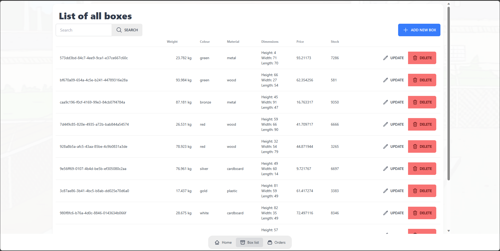

# Box Factory
This is the first compulsory assignment in the third semester of computer science at EASV.


<details>

  <summary>More Application looks</summary>

### Boxes
  
#### Create Box

#### Update Box


### Orders

#### Create Order


</details>


## Run (in development)
### Backend
```bash
cd BoxFactoryAPI
dotnet run
```

### Frontend
```bash
cd BFF
npm install
ng serve
```

## Team members
- [Maria](https://github.com/mariaruth1)
- [Matej](https://github.com/MatejMa2ur)
- [Julia](https://github.com/juuwel)

## Description
The boomer boss of the box factory wants to modernise by having an inhouse application to keep track of their products (boxes).

He wants employees to be able to add new boxes to their catalogue, edit existing, remove and find particular boxes based on searching and sorting preferences.

You, as the CTO, must decide what properties boxes have in the IT system. (In other words, there's no prebuilt database schema or starter app foundation to rely on).

Strict minimal requirements:
- [x] The client application must be built using Angular. 
- [x] The backend must be built using a .NET Web API + Relational Database. 
- [x] Communication between client and server should be done using HTTP. 
- [x] There must be data validation on both the client and server side. 
- [x] There must be at least 1 business entity and 1 table in the database. 
- There must be at least the following CRUD operations:
- [x] Create a new box 
- [x] Delete an existing box 
- [x] Search boxes 
- [x] See all details for one given box on it's own page (get by ID)
- [x] Updating a box 
- [x] Any testing deemed relevant must be conducted in order to assure quality. This can be E2E testing using Playwright (SDK is free of choice, but I recommend .NET Playwright) or integration testing of API's (simply calling the API with an HTTP client in an NUnit test and making assertions). 
- [x] You must have at least one workflow on Github Actions which automates building, running and testing of your application

If you finish early, I recommend challenging yourself with these:

- [x] ❗Optional hard feature ❗

The boomer boss also wants to keep track of orders. There must now be at least a box table, an order table and junction table. (1 order can have many box models and 1 box model can be on many orders, so this is a many-to-many relationship).

- [x] ⚠️Optional very hard feature⚠️

The boomer boss also wants visualisations of box sales from past orders. He likes to look at diagrams that show how many boxes are being sold over time, and wants you to use https://www.npmjs.com/package/apexcharts to visualise sales data coming from the API.

- [ ] ☢️Optional very very hard feature☢️

The boomer boss heard that AI is taking off, so he found a prebuilt AI model as an npm package(https://www.npmjs.com/package/@tensorflow-models/coco-ssd) to classify images of stuff he found in the warehouse. Maybe some of them are boxes? He wants employees to upload an image to the Angular app and let the model judge if it really is.

- [x] ⚰️Optional almost impossible feature⚰️

Fix your CSS so it looks good

##  Future plans for the project
- [ ] Add a login system
- [ ] Add a user system
- [ ] Add pagination and searching for orders
- [ ] Add stock management for boxes and orders
- [ ] Add filtering in frontend
- [ ] Add tests for frontend
- [ ] Add tests for orders in backend